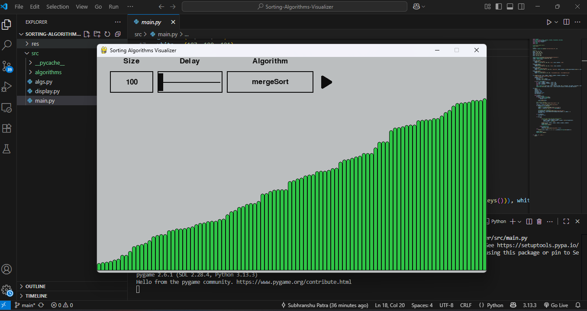

# Sorting Algorithms Visualizer

**Sorting Algorithms Visualizer** is an interactive Python application built with **Pygame** that lets you **see sorting algorithms in action**. It is designed for students, educators, and coding enthusiasts to **understand how different algorithms work** step by step, with real-time visual feedback.

---

## Features

- **Multiple Sorting Algorithms:**  
  Supports a wide range of algorithms including:

| Sorting Algorithm       | Best Case       | Average Case    | Worst Case     | Space Complexity |
|------------------------|----------------|----------------|----------------|----------------|
| Bead Sort              | O(n + m)       | O(n + m)       | O(n + m)       | O(1)           |
| Binary Insertion Sort  | O(n)           | O(n²)          | O(n²)          | O(1)           |
| Bitonic Sort           | O(n log² n)    | O(n log² n)    | O(n log² n)    | O(n log² n)    |
| Bogo Sort              | O(n)           | O(n!)          | O(n!)          | O(1)           |
| Bubble Sort            | O(n)           | O(n²)          | O(n²)          | O(1)           |
| Bucket Sort            | O(n + k)       | O(n + k)       | O(n²)          | O(n + k)       |
| Circle Sort            | O(n)           | O(n log n)     | O(n²)          | O(n)           |
| Cocktail Sort          | O(n)           | O(n²)          | O(n²)          | O(1)           |
| Comb Sort              | O(n log n)     | O(n² / 2^p)   | O(n²)          | O(1)           |
| Counting Sort          | O(n + k)       | O(n + k)       | O(n + k)       | O(k)           |
| Cycle Sort             | O(n²)          | O(n²)          | O(n²)          | O(1)           |
| Double Sort            | O(n)           | O(n²)          | O(n²)          | O(1)           |
| Exchange Sort          | O(n²)          | O(n²)          | O(n²)          | O(1)           |
| Gnome Sort             | O(n)           | O(n²)          | O(n²)          | O(1)           |
| Heap Sort              | O(n log n)     | O(n log n)     | O(n log n)     | O(1)           |
| Insertion Sort         | O(n)           | O(n²)          | O(n²)          | O(1)           |
| Intro Sort             | O(n log n)     | O(n log n)     | O(n log n)     | O(log n)       |
| Iterative Merge Sort   | O(n log n)     | O(n log n)     | O(n log n)     | O(n)           |
| Merge Insertion Sort   | O(n log n)     | O(n log n)     | O(n log n)     | O(n)           |
| Merge Sort             | O(n log n)     | O(n log n)     | O(n log n)     | O(n)           |
| MSD Radix Sort         | O(nk)          | O(nk)          | O(nk)          | O(n + k)       |
| Natural Sort           | O(n)           | O(n log n)     | O(n log n)     | O(n)           |
| Odd Even Sort          | O(n)           | O(n²)          | O(n²)          | O(1)           |
| Pancake Sort           | O(n)           | O(n²)          | O(n²)          | O(1)           |
| Patience Sort          | O(n log n)     | O(n log n)     | O(n²)          | O(n)           |
| Pigeon Sort            | O(n + m)       | O(n + m)       | O(n + m)       | O(m)           |
| Quick Sort             | O(n log n)     | O(n log n)     | O(n²)          | O(log n)       |
| Radix Sort             | O(nk)          | O(nk)          | O(nk)          | O(n + k)       |
| Selection Sort         | O(n²)          | O(n²)          | O(n²)          | O(1)           |
| Shell Sort             | O(n log n)     | O(n log² n)    | O(n²)          | O(1)           |
| Slow Sort              | O(n)           | O(n log n)     | O(n²)          | O(1)           |
| Stooge Sort            | O(n².709)      | O(n².709)      | O(n².709)      | O(1)           |
| Strand Sort            | O(n)           | O(n²)          | O(n²)          | O(n)           |
| Tim Sort               | O(n)           | O(n log n)     | O(n log n)     | O(n)           |
| Tree Sort              | O(n log n)     | O(n log n)     | O(n²)          | O(n)           |

- **Interactive Visualization:**  
  - Color-coded bars to indicate **comparisons, swaps, and sorted elements**.  
  - Adjustable **array size** and **animation speed** using sliders.  
  - **Play/Pause/Reset** buttons for controlling animations.  

- **User-Friendly Interface:**  
  - Dropdown menu to select sorting algorithm.  
  - Modern, responsive design with Pygame GUI widgets.  

- **Educational Value:**  
  - Observe the algorithm logic in real-time.  
  - Helps visualize **time complexity** and array transformations.  

---

## Installation

### 1. Clone the repository

```bash
git clone https://github.com/Subhranshu-Patra29/SortingAlgorithmVisualizer.git
cd sorting-algorithms-visualizer
```

### 2. Install libraries 

```bash
pip install pygame
```

### 3. Run the Visualizer

```bash
python src/main.py
```

## Watch Demo

To watch demo working, click here. 

[](https://www.dropbox.com/scl/fi/d30w3fbn8cgxi49cka6ii/mergeSortRec.mp4?rlkey=ounqo2ju4oq3it4uc7g90828q&st=zixuyj9w&dl=0)
